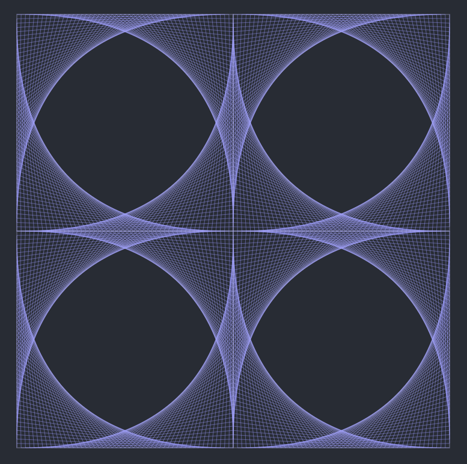
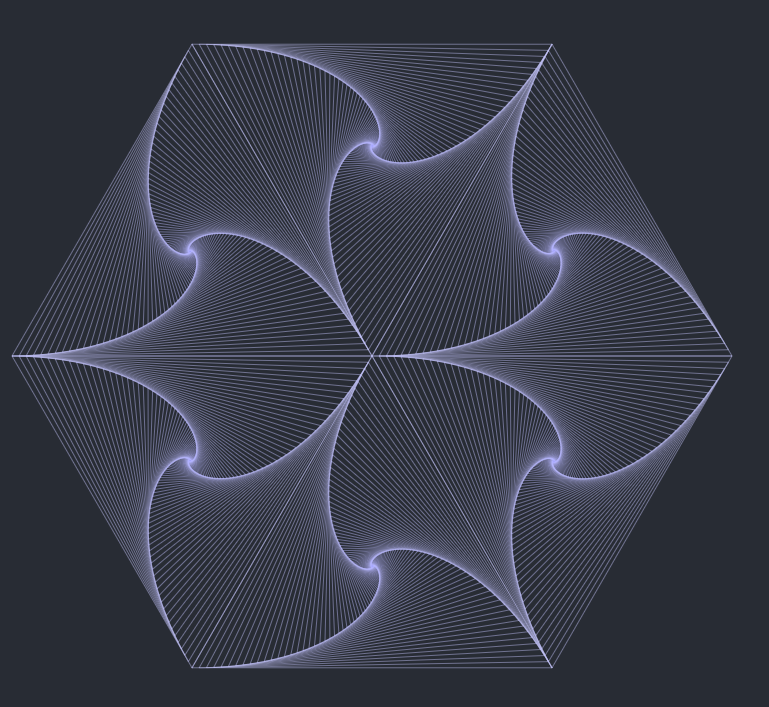

##Geometric Figures

This is a simple test visualizer of some geometric pattern, using Paper.js.

<table><tr>
<td></td>
<td></td>
</table></tr>

##Install

Being a straightforward JS project, it's sufficient to clone the repo e run

```bash
npm install
```

####Run

By default, the program runs from an express server at address `localhost:10000`. To run it this way, execute 
```bash
node index.js
```

else, the static JS code is in the folder [`static.js`](./static_js), and it can be run as a static page dependent on [`index.html`](./static_js/index.html)
